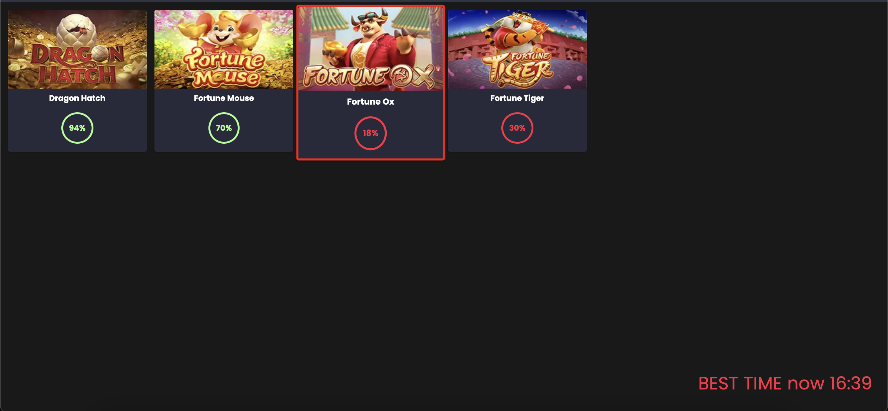

# Pg slot bot

Pg slot bot is an application that performs web scraping on various pages to check which pg slot games are paying the most. It emits audible alerts and highlights in red the best times for certain games, and updates the values when it's not the best time.



## Prerequisites

Before running Pg slot bot, make sure you have the following prerequisites installed:

- Docker: [Docker Installation](https://docs.docker.com/get-docker/)

## Installation

Follow these steps to run the application locally via Docker:

1. Open a terminal and execute the following command to download the Pg slot bot image:

   ```shell
   docker pull elioenaiferrari/pg_slot_bot
   ```

2. After downloading the image, run the application with the following command:

   ```shell
   docker run -p 4001:4001 -d elioenaiferrari/pg_slot_bot
   ```

The application is now running locally and can be accessed in the browser at `http://localhost:4001`.

## Usage

The Pg slot bot application is designed to perform web scraping on various pages and provide information about the best times for pg slot games that are paying the most. Here are the key features:

- The application regularly checks web pages to find the best times for pg slot games that are paying the most.

- When one of the best times is reached, the application emits an audible alert and highlights the recommended time in red.

- When it's not one of the best times, the application emits a message indicating that it is updating the values but does not emit audible alerts.

Be sure to check the application's interface in the browser for updated information on the best times.

## Contribution

If you wish to contribute to this project, follow these steps:

1. Fork the repository.

2. Clone the fork to your local machine:

   ```shell
   git clone https://github.com/ElioenaiFerrari/pg_slot_bot.git
   ```

3. Create a branch for your changes:

   ```shell
   git checkout -b feature/your-feature
   ```

4. Make your desired changes and clearly communicate them in your commits.

5. Push your changes to your fork:

   ```shell
   git push origin feature/your-feature
   ```

6. Open a pull request to the original repository.

## License

This project is licensed under the [MIT License](LICENSE).

---